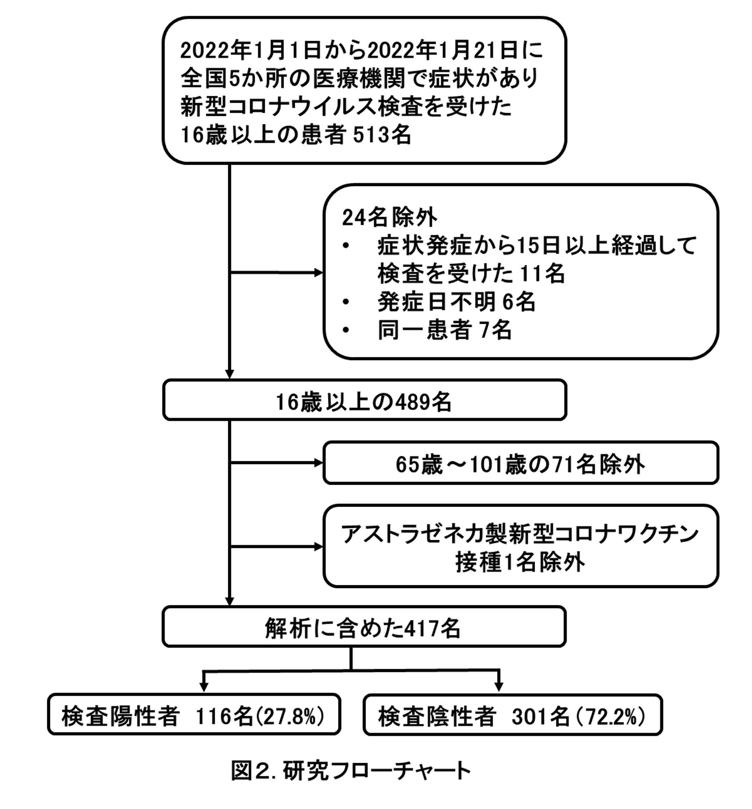

```{r,echo=FALSE,include=FALSE,warning=FALSE}
packages <- c("tidyverse","flextable")
lapply(packages, require, character.only = TRUE) 

df_1 <- readxl::read_excel("./data/ve_nagasaki_v3/ve_nagasaki_table_v3.xlsx",sheet = 1,skip = 1) %>% 
  rename(" "=1)

typology <- data.frame(
col_keys = c( " ", "全体 (n=417)", "検査陽性 (n=116)","検査陰性 (n=301)"),
stringsAsFactors = FALSE )

ft_1 <- regulartable(data = df_1, col_keys = names(df_1),
                         cwidth = 2.0, cheight = 0.20)
ft_1 <- align(ft_1, align = "right", part = "all")
ft_1 <- align(ft_1,j = c("全体 (n=417)","検査陽性 (n=116)","検査陰性 (n=301)"), align = "right", part = "body")
ft_1 <- align(ft_1,j = c( " "), align = "left", part = "body")

df_2 <- readxl::read_excel("./data/ve_nagasaki_v3/ve_nagasaki_table_v3.xlsx",sheet = 2,skip = 1) %>% 
  slice(-14) %>% 
  rename(" "=1,"  "=2)

typology <- data.frame(
col_keys = c( " ","  ", "全体 (n=417)", "検査陽性 (n=116)","検査陰性 (n=301)"),
stringsAsFactors = FALSE )

ft_2 <- regulartable(data = df_2, col_keys = names(df_2),
                         cwidth = 2.0, cheight = 0.20)
ft_2 <- align(ft_2, align = "right", part = "all")
ft_2 <- align(ft_2,j = c("全体 (n=417)","検査陽性 (n=116)","検査陰性 (n=301)"), align = "right", part = "body")
ft_2 <- align(ft_2,j = c( " "), align = "left", part = "body")
ft_2 <- merge_at(ft_2, i = 4, j = 1:2 )
ft_2 <- merge_at(ft_2, i = 6, j = 1:2 )
ft_2 <- merge_at(ft_2, i = 8, j = 1:2 )
ft_2 <- merge_at(ft_2, i = 10, j = 1:2 )
ft_2 <- add_footer_row(ft_2, values = c("*ワクチン接種歴のある363名のみ"), colwidths = 5)

df_3 <- readxl::read_excel("./data/ve_nagasaki_v3/ve_nagasaki_table_v3.xlsx",sheet = 3,skip = 1) %>% 
  rename(" "=1,"  "=2,"調整オッズ比\n（95%信頼区間）"=3,"ワクチン有効率(%)\n（95%信頼区間）"=4) 

ft_3 <- regulartable(data = df_3,names(df_3),cwidth = 3.5, cheight = 0.20)
ft_3 <- align(ft_3, align = "center", part = "all")
ft_3 <- align(ft_3,j = c("調整オッズ比\n（95%信頼区間）","ワクチン有効率(%)\n（95%信頼区間）"), 
              align = "right",part = "body")
ft_3 <- align(ft_3,j = c( " "), align = "left", part = "body")
ft_3 <- merge_at(ft_3, i = 1, j = 1:2 )
ft_3 <- merge_at(ft_3, i = 3, j = 1:2 )
```


### 新型コロナワクチンの有効性に関する研究 〜国内多施設共同症例対照研究〜

**Vaccine Effectiveness Real-Time Surveillance for SARS-CoV-2 (VERSUS) Study、第3報**

**長崎大学熱帯医学研究所**

掲載日：2022年1月26日

### 要約

 長崎大学熱帯医学研究所を中心とする研究チームは、全国の医療機関（病院および診療所）と協力し、新型コロナワクチンの有効性を評価する研究を2021年7月1日から開始した。今回、新型コロナウイルスの変異株B.1.1.529 系統（オミクロン株）が全国で広がり始めた2022年1月1日以降に新型コロナウイルス検査を受けた患者情報を用いて、この期間の発症予防における新型コロナワクチンの有効性について暫定値をまとめた。16歳～64歳において、ファイザー社製あるいはモデルナ社製いずれかのワクチンの2回接種完了（2回接種後14日以上経過）による発症予防における有効性を51.7% (95%信頼区間：2.0～76.2%） と推定した。デルタ株が流行した2021年7月1日から9月30日における同値は88.7% (95%信頼区間：78.8%～93.9%)であり、新型コロナワクチンの有効性は低下していると考えられた。
 本報告は極めてサンプルサイズが限られているが、公衆衛生学的意義を鑑みつつ、暫定値を報告した。本報告は長期サーベイランス研究の一部であり、随時アップデートした結果を報告する予定である。

### 背景

長崎大学熱帯医学研究所を中心とする研究チームは、全国の医療機関（病院および診療所）と協力し、新型コロナワクチンの有効性を評価する研究を2021年7月1日から開始した。今回、新型コロナウイルスの変異株B.1.1.529 系統（オミクロン株）が全国で広がり始めた2022年1月1日以降に新型コロナウイルス検査を受けた患者情報を用いて、この期間の発症予防における新型コロナワクチンの有効性について暫定値をまとめた。16歳～64歳において、ファイザー社製あるいはモデルナ社製いずれかのワクチンの2回接種完了（2回接種後14日以上経過）による発症予防における有効性を51.7% (95%信頼区間：2.0～76.2%） と推定した。デルタ株が流行した2021年7月1日から9月30日における同値は88.7% (95%信頼区間：78.8%～93.9%)であり、新型コロナワクチンの有効性は低下していると考えられた。
本報告は極めてサンプルサイズが限られているが、公衆衛生学的意義を鑑みつつ、暫定値を報告した。本報告は長期サーベイランス研究の一部であり、随時アップデートした結果を報告する予定である。

### 方法

2021年7月1日から開始しているサーベイランス研究(VERSUS study)のうち、2022年1月1日から1月21日までに全国4都県（東京都、神奈川県、埼玉県、愛知県）、計5か所の病院または診療所において、新型コロナウイルス感染症が疑われる症状1)で受診した16歳以上の患者を対象に、患者基本情報、症状、新型コロナワクチン接種歴（接種の有無、接種回数、接種日、接種したワクチンの種類）、新型コロナウイルス検査結果のデータを収集した。新型コロナウイルスの検査は、現在国内で確定診断に使用されている核酸増幅法検査（PCRやLAMPなど）および抗原定量検査を対象とした。新型コロナウイルス検査陽性者を症例群、陰性者を対照群とした（図1）。発症から15日以降に検査を受けた患者および発症日が不明の患者を解析から除外し、同一患者は定義2)に基づいて除外した。65歳以上は新型コロナワクチン優先接種対象であり、接種時期やワクチン接種後の経過期間などに交絡がある可能性を考慮して、16歳～64歳、65歳以上に分けての解析を予定したが、65歳以上はサンプルサイズが極めて少なかったため、本報告では16～64歳のみを解析対象とした。

{width="600"}

新型コロナワクチン接種歴は、未接種、1回のみ接種（接種後13日以内）、1回のみ接種完了（接種後14日以上経過）、2回接種（2回目接種後13日以内）、2回接種完了（2回目接種後14日以上経過）、3回接種（3回目接種後13日以内）、3回接種完了（3回目接種後14日以上経過）、接種歴不明の8つのグループに分けた。検査結果（陽性・陰性）に接種歴を含む種々の要因が与える影響を、混合効果ロジスティック回帰モデルを構築して調整オッズ比と95%信頼区間を算出して評価した。ワクチンの有効性は、(1-調整オッズ比)×100%で算出した。回帰モデルには、検査結果（陽性・陰性）を被説明変数、新型コロナワクチン接種歴、年齢、性別、基礎疾患の有無、検査実施カレンダー週、新型コロナウイルス感染症患者との接触の有無を固定効果 （fixed effect）、検査実施医療機関を変量効果 (random effect)の説明変数として組み込んだ。サンプルサイズが限られていたため、ワクチンの種類はファイザー社製 (BNT162b2)・モデルナ社製 (mRNA-1273)の両方を含めた解析のみをおこなった。正確なワクチン接種日が不明であった患者については、接種日の推定法が接種後の経過日数、さらには接種完了の有無の判断にも影響しうる。感度分析として、複数の方法で接種日を推定した解析を行った。また、接種したワクチンの種類が不明な患者については、アストラゼネカ社製ワクチンを接種した可能性もあるため、感度分析として、ワクチンの種類が不明な患者を除外した解析も行った。
本研究は長崎大学熱帯医学研究所および協力医療機関における倫理委員会で審査を受け、承認された後、実施した（長崎大学熱帯医学研究所倫理委員会における承認番号：210225257）。(倫理委員会がない医療機関では、長崎大学熱帯医学研究所倫理委員会で一括審査を行った。)


### 結果

全国4都県計5か所の医療機関において、2022年1月1日から1月21日までに新型コロナウイルス感染症が疑われる症状があり、検査を受けた16歳以上の患者513名が登録された。そのうち、発症日から15日以降に検査を受けた11名、発症日が不明の6名、同一患者2)の7名、65歳以上の71名、アストラゼネカ社製新型コロナワクチンを接種した１名を解析から除外し、合計417名を解析に含めた(図2)。

{height="400"}

解析対象者の基本情報を表１に示す。年齢中央値（四分位範囲）32歳（24～43歳）、男性は227名（54.4%）、416名（99.8%）は自宅生活者であり、43名（10.3%）に基礎疾患3)があった。67名（16.1%）に新型コロナウイルス感染症患者との接触歴があった。解析対象者の新型コロナワクチン接種歴を表2に示す。未接種53名（12.7%）、1回のみ接種完了5名（1.2%）、2回接種完了者346名（83.0%）、接種歴不明1名（0.2%）であった。

**表 1：解析対象者（16歳～64歳）の基本情報と検査方法**

```{r, echo=FALSE,warning =FALSE, results = "asis", fig.width=20,fig.height=7}
ft_1
```


**表 2：解析対象者（16歳～64歳）のワクチン接種歴**

```{r, echo=FALSE,warning =FALSE, results = "asis", fig.width=12,fig.height=7}
ft_2
```

研究対象者全体の83.0% (346人)が2回接種完了者で、未接種者は12.7% (53人)にとどまった。一方で検査陽性率は2回接種完了者が25.4% (88人)、非接種者が45.3% (24人)で2回接種完了者が有意に低かった(粗オッズ比0.412、95%信頼区間: 0.219～0.784)。
16歳から64歳の患者におけるファイザー社製・モデルナ社製いずれかのワクチン2回接種完了者（2回目接種後14日以上経過）の未接種者に対する検査陽性の調整オッズ比およびワクチンの有効率を表3に示す。調整オッズ比は0.483（95%信頼区間：0.238～0.980）、調整オッズ比を用いたワクチンの有効率は51.7% （95%信頼区間：2.0～76.2%）であった。調整因子には、固定効果として年齢、性別、基礎疾患の有無、検査実施カレンダー週、新型コロナウイルス感染症患者との接触の有無、変量効果として検査実施医療機関を組み込んでいる。

**表 3：16歳から64歳における2回接種完了者の未接種者に対する検査陽性の調整オッズ比およびワクチン有効率**

```{r echo=FALSE, fig.height=7, fig.width=12, warning=FALSE, results="asis"}
ft_3
```

第2報で報告した2021年7月から9月の登録患者情報から求めたワクチンの有効性と今回のワクチンの有効性の比較を図3に示す。2021年7月から9月のワクチンの有効性と比較して、今回、有効性が低下していることを確認した。

{height="250"}

正確なワクチン接種日が不明であった患者については、接種日の推定法が接種後の経過日数、接種完了の有無の判断にも影響しうるため、今回は感度分析として複数の方法で接種日を推定した解析結果を比較したが、調整オッズ比に与える影響は限定的であった。また、接種したワクチンの種類が不明な患者を除外した解析でも、調整オッズ比に与える影響はやはり限定的であった。
           
### 考察

本報告では、2022年1月1日から1月21日の期間において、16歳から64歳を対象としたファイザー社製新型コロナワクチン(BNT162b2)あるいはモデルナ社製新型コロナワクチン(mRNA-1273)について、2回目接種後14日以上経過したものにおいて未接種者と比較し、発症予防における有効性は51.7% (95%信頼区間：2.0～76.2%）と推定された。2021年7月1日から9月30日(B1.617.2系統（デルタ株）流行期)と比較して、発症予防における有効性は低下していることが示された。本報告に組み込まれた患者は2022年1月1日から1月21日に検査を受けた患者であり、全国的にオミクロン株の感染が拡大した時期であった。（本報告に組み込まれた東京都、神奈川県、埼玉県、愛知県では9割以上がオミクロン株であると推定された時期であった(5)。）オミクロン株は、ワクチン接種者の血清による中和能の低下が様々な研究から示され(6-9)、発症予防におけるワクチンの有効性が、デルタ株と比較してオミクロン株では低下すると考えられている。一方、ワクチンの2回接種からの時間経過によるワクチンの有効性の低下も多数報告されている(10-12)。2021年7月～9月の結果と比較した本報告のワクチンの有効性低下の原因として、オミクロン株に対するワクチンの有効性の低下によるもの、またはワクチンの2回接種からの時間経過によるものが考えられる。本報告のサンプルサイズは極めて限られたものであり、今後、対象患者の集積により、より詳細な解析が可能であると考えている。
なお、本報告は本研究の暫定データであり、ワクチンの有効性の推定値の信頼区間も広く、今後の対象患者の蓄積と解析により、変動すると考えられる。また、ワクチンの入院予防における有効性や重症化予防の有効性は本研究では評価ができないため、多方面からの研究が必要である。なお、研究参加医療機関の1月分の登録患者情報を使用し、今後アップデートした結果を報告する予定である。


### 制限

本報告にはいくつかの制限がある。1つ目は、対象患者が2022年１月1日から1月21日の全国5か所の医療機関に限られており、現時点ではサンプルサイズが極めて限定的である。2つ目は、現在日本では医療機関において受診者のワクチン接種歴を自動的に確認できるシステムは整備されていないため、接種歴は患者（または患者家族）に対する問診で得られた記録を基にしており、思い出しバイアスの影響を否定できない。正確なワクチン接種日が不明な患者については、「接種日」の推計方法を複数定めた感度分析を、接種したワクチンの種類が不明な患者については、除外した解析を行ったが、調整オッズ比の変動は小さく、一定の妥当性は担保されていると考える。3つ目は、65歳以上におけるワクチンの有効性、各ワクチンの解析や3回目接種の有効性は本報告では検討できていない。
本報告は2022年1月21日での暫定結果であり速報値であるが、公衆衛生学的に意義があると判断して報告した。今後も研究を継続し経時的な評価を行うなかで、公衆衛生学的な意義を鑑みつつ結果について共有する予定である。


### 注釈

1\)
発熱（37.5℃以上）、咳、倦怠感、呼吸困難、筋肉痛、咽頭痛、鼻汁・鼻閉、頭痛、下痢、味覚障害、嗅覚障害(13, 14)

2\) 同一症例の扱いは以下の定義を使用した(15)。

・陽性結果が出る前の3週間以内、または陽性結果が出た後に採取した陰性検査は、偽陰性の可能性があるため除外する。

・同じ発症日に対して行われた陰性の検査は除外する。

・前回の陰性判定から7日以内に実施された陰性の検査は除外する。

・各人については、無作為に選んだ3回までの検査は含める。

・90日以内に複数回陽性になった場合は初めての陽性のみを組み込む。

3\)
慢性心疾患、慢性呼吸器疾患、肥満（BMI≧30）、悪性腫瘍（固形癌または血液腫瘍）、糖尿病、慢性腎不全、透析、肝硬変、免疫抑制薬の使用、妊娠

### 研究チーム

長崎大学熱帯医学研究所　臨床研究部門：前田　遥、森本浩之輔

大分大学　医学部　微生物学講座：齊藤信夫

横浜市立大学　医学群　健康社会医学ユニット・東京大学大学院　薬学系研究科　医薬政策学：
五十嵐中　

**参加医療施設（50音順、敬称略、本報告に含まれる医療機関のみを記載）**

*川崎市立多摩病院：本橋伊織、宮沢　玲

北福島医療センター/福島県立医科大学：山藤栄一郎

群馬中央病院：阿久澤暢洋、原田 武

五本木クリニック：桑満おさむ

*埼玉県済生会栗橋病院：木村祐也、小美野勝、新井博美

*ＪＡ愛知厚生連　豊田厚生病院：伊藤貴康

市立奈良病院：森川　暢

*髙木整形外科・内科：大原靖二

近森病院：石田正之

虹が丘病院：寺田真由美

早川内科医院：早川友一郎

みずほ通りクリニック：勅使川原修

*ロコクリニック中目黒：嘉村洋志

なお、本報告書に含まれるデータは、*の医療機関に限る。

**研究協力**

国立感染症研究所　感染症疫学センター：鈴木　基

### 研究資金

本研究は、AMED(国立研究開発法人日本医療研究開発機構)の課題番号JP21fk0108612の支援を受けている。

### 利益相反の開示

長崎大学熱帯医学研究所　臨床研究部門は、ファイザー社より本研究に関連のない研究助成金を受けている。
東京大学大学院　薬学系研究科　医薬政策学は、武田薬品工業株式会社（モデルナ社製新型コロナワクチン(mRNA-1273)の日本国内での供給をおこなっている）より本研究に関係のない研究助成金を受けている。


### 参考資料

1.	Nauta J. Statistics in Clinical and Observational Vaccine Studies 2nd edition: Springer.

2.	Sullivan SG, Feng S, Cowling BJ. Potential of the test-negative design for measuring influenza vaccine effectiveness: a systematic review. Expert Rev Vaccines. 2014;13(12):1571-91.

3.	長崎大学熱帯医学研究所. 新型コロナワクチンの有効性に関する研究 〜国内多施設共同症例対照研究〜 第1報  Available from: https://covid-19-japan-epi.github.io/output/新型コロナワクチンの有効性研究.html

4.	長崎大学熱帯医学研究所. 新型コロナワクチンの有効性に関する研究 〜国内多施設共同症例対照研究〜第2報  Available from: https://covid-19-japan-epi.github.io/output/ve_nagasaki_v2.html

5.	厚生労働省. 新型コロナウイルス感染症（変異株）への対応、第68回（令和4年1月20日）新型コロナウイルス感染症対策アドバイザリーボード資料  Available from: https://www.mhlw.go.jp/content/10900000/000885776.pdf

6.	Carreno JM, Alshammary H, Tcheou J, Singh G, Raskin A, Kawabata H, et al. Activity of convalescent and vaccine serum against SARS-CoV-2 Omicron. Nature. 2021.

7.	Cele S, Jackson L, Khoury DS, Khan K, Moyo-Gwete T, Tegally H, et al. Omicron extensively but incompletely escapes Pfizer BNT162b2 neutralization. Nature. 2021.

8.	Dejnirattisai W, Shaw RH, Supasa P, Liu C, Stuart ASV, Pollard AJ, et al. Reduced neutralisation of SARS-CoV-2 omicron B.1.1.529 variant by post-immunisation serum. The Lancet. 2022;399(10321):234-6.

9.	Lu L, Mok BW, Chen LL, Chan JM, Tsang OT, Lam BH, et al. Neutralization of SARS-CoV-2 Omicron variant by sera from BNT162b2 or Coronavac vaccine recipients. Clin Infect Dis. 2021.

10.	Goldberg Y, Mandel M, Bar-On YM, Bodenheimer O, Freedman L, Haas EJ, et al. Waning Immunity after the BNT162b2 Vaccine in Israel. N Engl J Med. 2021.

11.	Tartof SY, Slezak JM, Fischer H, Hong V, Ackerson BK, Ranasinghe ON, et al. Effectiveness of mRNA BNT162b2 COVID-19 vaccine up to 6 months in a large integrated health system in the USA: a retrospective cohort study. The Lancet. 2021;398(10309):1407-16. 

12. Andrews N, Tessier E, Stowe J, Gower C, Kirsebom F, Simmons R, et al. Vaccine effectiveness and duration of protection of Comirnaty, Vaxzevria and Spikevax against mild and severe COVID19 in the UK. medRxiv.2021:2021.06.28.21259420

13.	World Health Organization. Coronavirus Available from: https://www.who.int/health-topics/coronavirus#tab=tab_3

14.	Centers for Disease Control and Prevention. Symptoms of Coronavirus 2021 Available from: https://www.cdc.gov/coronavirus/2019-ncov/symptoms-testing/symptoms.html

15.	Lopez Bernal J, Andrews N, Gower C, Gallagher E, Simmons R, Thelwall S, et al. Effectiveness of Covid-19 Vaccines against the B.1.617.2 (Delta) Variant. N Engl J Med. 2021;2021 Aug 12;385(7):585-594.

------------------------------------------------------------------------

### 問い合わせ先

長崎大学熱帯医学研究所　臨床研究部門：森本浩之輔　

komorimo\*nagasaki-u.ac.jp（\*を\@にして送信して下さい）
