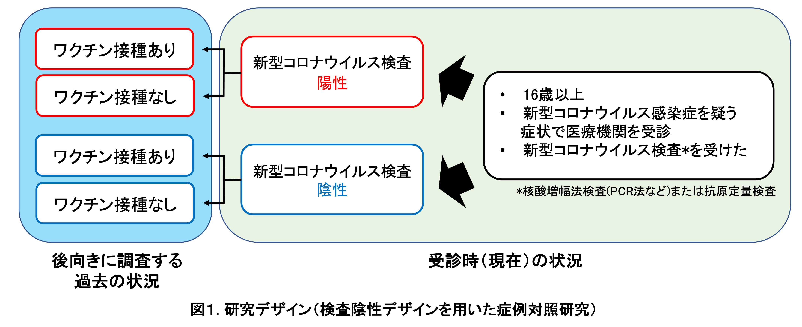
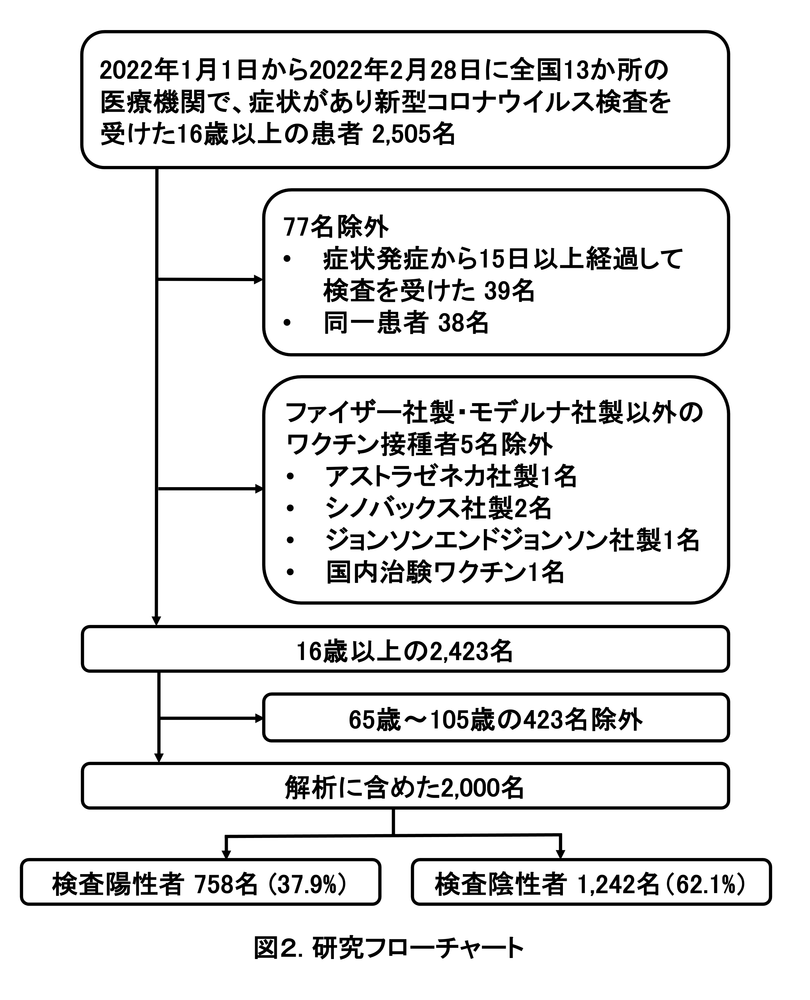
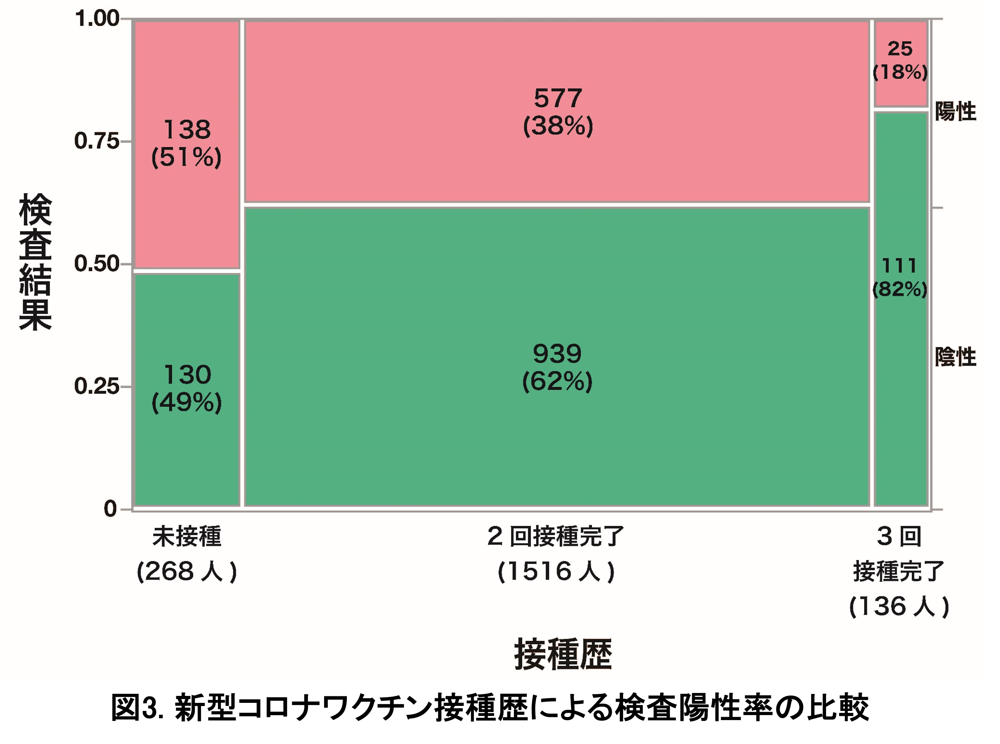
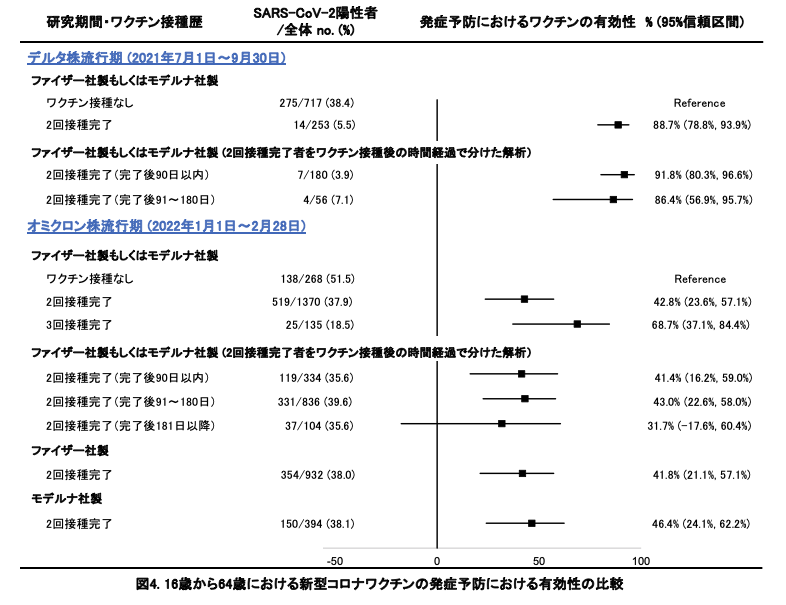

```{r,echo=FALSE,include=FALSE,warning=FALSE}
packages <- c("tidyverse","flextable","officer")
lapply(packages, require, character.only = TRUE) 

df_1 <- readxl::read_excel("./data/ve_nagasaki_v4/ve_nagasaki_table_v4.xlsx",sheet = 1,skip = 1) %>% 
  rename(" "=1,"  "=2)

typology <- data.frame(
col_keys = c( " ","  ", "全体 (n=2,000)", "検査陽性 (n=758)","検査陰性 (n=1,242)"),
stringsAsFactors = FALSE )

ft_1 <- regulartable(data = df_1, col_keys = names(df_1),
                         cwidth = 2.0, cheight = 0.20)
ft_1 <- align(ft_1, align = "right", part = "all")
ft_1 <- align(ft_1,j = c("全体 (n=2,000)","検査陽性 (n=758)","検査陰性 (n=1,242)"), align = "right", part = "body")
ft_1 <- align(ft_1,j = c( " "), align = "left", part = "body")
ft_1 <- merge_at(ft_1, i = 31, j = 1:2 )
ft_1 <- merge_at(ft_1, i = 35, j = 1:2 )

df_2 <- readxl::read_excel("./data/ve_nagasaki_v4/ve_nagasaki_table_v4.xlsx",sheet = 2,skip = 1) %>% 
  rename(" "=1,"  "=2)

typology <- data.frame(
col_keys = c( " ","  ", "全体 (n=2,000)","検査陽性 (n=758)","検査陰性 (n=1,242)"),
stringsAsFactors = FALSE )

ft_2 <- regulartable(data = df_2, col_keys = names(df_2),
                         cwidth = 2.0, cheight = 0.20)
ft_2 <- align(ft_2, align = "right", part = "all")
ft_2 <- align(ft_2,j = c("全体 (n=2,000)","検査陽性 (n=758)","検査陰性 (n=1,242)"), align = "right", part = "body")
ft_2 <- align(ft_2,j = c( " "), align = "left", part = "body")
ft_2 <- merge_at(ft_2, i = 1, j = 1:2 )
ft_2 <- merge_at(ft_2, i = 4, j = 1:2 )
ft_2 <- merge_at(ft_2, i = 6, j = 1:2 )
ft_2 <- merge_at(ft_2, i = 8, j = 1:2 )
ft_2 <- merge_at(ft_2, i = 10, j = 1:2 )
ft_2 <- hline(ft_2, i = 9, j = 1:5, border = fp_border(color="black"), part="body")

df_3 <- readxl::read_excel("./data/ve_nagasaki_v4/ve_nagasaki_table_v4.xlsx",sheet = 3,skip = 1) %>% 
  rename(" "=1,"  "=2,"  　 "=3,"調整オッズ比\n（95%信頼区間）"=4,"有効性(%)\n（95%信頼区間）"=5) 

ft_3 <- regulartable(data = df_3,names(df_3),cwidth = 3, cheight = 0.20)
ft_3 <- align(ft_3, align = "center", part = "all")
ft_3 <- align(ft_3,j = c("調整オッズ比\n（95%信頼区間）","有効性(%)\n（95%信頼区間）"), 
              align = "right",part = "body")
ft_3 <- align(ft_3,j = c( " "), align = "left", part = "body")
ft_3 <- merge_at(ft_3, i = 1, j = 1:3 )
ft_3 <- merge_at(ft_3, i = 3, j = 1:3 )
ft_3 <- merge_at(ft_3, i = 4, j = 1:3 )
ft_3 <- merge_at(ft_3, i = 5, j = 1:3 )
ft_3 <- merge_at(ft_3, i = 6, j = 1:3 )
ft_3 <- merge_at(ft_3, i = 8, j = 1:3 )
ft_3 <- merge_at(ft_3, i = 9, j = 1:3 )
ft_3 <- merge_at(ft_3, i = 10, j = 1:3 )
ft_3 <- merge_at(ft_3, i = 13, j = 1:3 )
ft_3 <- merge_at(ft_3, i = 16, j = 1:3 )

```

### 新型コロナワクチンの有効性に関する研究 〜国内多施設共同症例対照研究〜

**Vaccine Effectiveness Real-Time Surveillance for SARS-CoV-2 (VERSUS)
Study、第4報**

**長崎大学熱帯医学研究所**

掲載日：2022年3月25日

<br>

### 要約

長崎大学熱帯医学研究所を中心とする研究チームは、全国の医療機関
（病院および診療所）と協力し、新型コロナワクチンの発症予防における有効性を評価する研究を2021年7月1日から開始した。今回、新型コロナウイルスの変異株B.1.1.529
系統
（オミクロン株）が全国で拡大した2022年1月1日から2月28日に新型コロナウイルス検査を受けた患者情報を用いて、この期間の発症予防における新型コロナワクチンの有効性について暫定値をまとめた。
16歳～64歳において、ファイザー社製あるいはモデルナ社製いずれかのワクチンの2回接種完了
（2回接種後14日以上経過）による発症予防における有効性を42.8%
(95%信頼区間：23.6～57.1%）、3回接種完了
（3回接種後14日以上経過）における有効性を68.7%
(95%信頼区間：37.1～84.4%)と推定した。2回接種完了による有効性について、ファイザー社製ワクチンに限定すると41.8%
(95%信頼区間：21.1～57.1%)、モデルナ社製ワクチンに限定すると46.4%
(95%信頼区間：24.1～62.2%)と推定した。2回接種完了群においてワクチン接種からの時間経過でわけて解析したところ、接種完了後から90日以内の有効性は41.4%
(95%信頼区間：16.2～59.0%)、91～180日では43.0%
(95%信頼区間：22.6～58.0%)、181日以降では31.7%
(95%信頼区間：-17.6～60.4%)であり、時間経過とともにワクチンの有効性が減弱している可能性があると考えられた。本研究の第2報で報告した、デルタ株が流行した2021年7月1日から9月30日における発症予防における有効性と比較したところ、接種からの時間経過を加味しても新型コロナワクチンの有効性は低下していると考えられ、オミクロン株への置き換わりによる有効性の低下と考えた。
本報告は極めてサンプルサイズが限られているが、公衆衛生学的意義を鑑みつつ、暫定値を報告した。本報告は長期サーベイランス研究の一部であり、2022年1月1日から2月28日においても、集計できていない情報もあるため、今後結果が変わる可能性があり、随時アップデートした結果を報告する予定である。

<br>

### 背景

海外諸国に続き、2021年2月から日本でも新型コロナワクチン接種が開始され、同年12月からは追加接種を開始している。国内において、より適切なワクチン政策を議論する際の科学的根拠として、国内における最新のワクチンの有効性データは必要不可欠である。
2021年7月1日から長崎大学熱帯医学研究所を中心とした研究チームは、全国の医療機関
（病院および診療所）と協力し、これまでにインフルエンザワクチンや肺炎球菌ワクチンの研究で使用されている検査陰性デザイン
（test-negative design：TND）を用いた症例対照研究を使って (1,
2)、新型コロナワクチンの有効性を経時的に評価するサーベイランス研究
(Vaccine Effectiveness Real-time Surveillance for SARS-CoV-2 (VERSUS)
study)を開始した
(3)。第2報では、2021年7月1日から9月30日までの登録患者の情報を解析し、16歳以上での新型コロナワクチンの包括的有効性、ワクチンの種類ごとの有効性、ワクチン接種後の経過期間による有効性の違いを報告した
(4)。2021年7月1日から9月30日の期間は全国的に新型コロナウイルスの90%以上がデルタ株であったため、同結果はデルタ株へのワクチンの有効性と考えた。第3報では、新型コロナウイルスの変異株B.1.1.529
系統
（オミクロン株）の流行が始まった2022年1月のデータを用い、同期間における新型コロナワクチンの発症予防における有効性が、第2報と比較して低下していることを明らかにした
（5）。
今回、2022年1月1日から2月28日に新型コロナウイルスの検査を受けた患者情報を使用して、3回目追加接種による有効性を含め、この期間の新型コロナワクチンの発症予防における有効性を評価したため報告する。

<br>

### 方法

2021年7月1日から開始しているサーベイランス研究 (VERSUS
study)のうち、2022年1月1日から2月28日までに全国10都県
（福島県、埼玉県、東京都、神奈川県、群馬県、愛知県、奈良県、高知県、福岡県、長崎県）、計13か所の病院または診療所において、新型コロナウイルス感染症が疑われる症状1)で受診した16歳以上の患者を対象に、患者基本情報、症状、新型コロナワクチン接種歴
（接種の有無、接種回数、接種日、接種したワクチンの種類）、新型コロナウイルス検査結果のデータを収集した。新型コロナウイルスの検査は、現在国内で確定診断に使用されている核酸増幅法検査
（PCRやLAMPなど）および抗原定量検査を対象とした。新型コロナウイルス検査陽性者を症例群、陰性者を対照群とした
（図1）。発症から15日以降に検査を受けた患者および同一患者は定義2)に基づいて除外した。65歳以上は新型コロナワクチン優先接種対象であり、接種時期やワクチン接種後の経過期間などに交絡がある可能性を考慮して、16歳～64歳、65歳以上に分けての解析を予定したが、本報告では65歳以上はサンプル数が少なかったため、今回は16～64歳のみを解析対象とした。

{width="744"}

新型コロナワクチン接種歴は、未接種、1回のみ接種
（接種後13日以内）、1回のみ接種完了 （接種後14日以上経過）、2回接種
（2回目接種後13日以内）、2回接種完了
（2回目接種後14日以上経過）、3回接種
（3回目接種後13日以内）、3回接種完了
（3回目接種後14日以上経過）、接種歴不明の8つのグループに分けた。検査結果
（陽性・陰性）に接種歴を含む種々の要因が与える影響を、混合効果ロジスティック回帰モデルを構築して調整オッズ比と95%信頼区間を算出して評価した。ワクチンの有効性は、(1-調整オッズ比)×100%で算出した。回帰モデルには、検査結果（陽性・陰性）を被説明変数、新型コロナワクチン接種歴、年齢、性別、基礎疾患の有無、検査実施カレンダー週、新型コロナウイルス感染症患者との接触の有無、医療従事者であるかどうか、を固定効果
（fixed effect）、検査実施医療機関を変量効果 (random
effect)の説明変数として組み込んだ。医療従事者は3回目接種の優先接種者であることに加え、非医療従事者と比較して感染対策や検査を受ける頻度が異なる可能性を考え、今回の解析では回帰モデルに組み込んだ。ワクチンの種類については、ファイザー社製
(BNT162b2)・モデルナ社製
(mRNA-1273)以外のワクチン接種を受けた患者が極めて少ないため、それらは除外した。2回接種完了については、ファイザー社製・モデルナ社製の両方を含めた解析および各ワクチンの解析をおこなった。接種したワクチンの種類が不明な症例であっても、接種時期によりワクチンの種類が推定できるものについては、推定し、使用した。3回目接種に関しては、ファイザー社製・モデルナ社製の両方を含めた解析を行った。接種後の時間経過によるワクチンの有効性の減弱の有無を評価することを目的として、ファイザー社製・モデルナ社製いずれかのワクチンについて、2回目接種完了
（接種後14日経過）後90日以内、91～180日、181日以上経過の3群にわけての評価もおこなった。
正確なワクチン接種日が不明であった患者については、接種日の推定法が接種後の経過日数、さらには接種完了の有無の判断にも影響しうる。感度分析として、複数の方法で接種日を推定した解析を行った。
本研究は長崎大学熱帯医学研究所および協力医療機関における倫理委員会で審査を受け、承認された後、実施した
（長崎大学熱帯医学研究所倫理委員会における承認番号：210225257）。(倫理委員会がない医療機関では、長崎大学熱帯医学研究所倫理委員会で一括審査を行った。)

<br>

### 結果

全国10都県計13か所の医療機関において、2022年1月1日から2月28日までに新型コロナウイルス感染症が疑われる症状1)があり、検査を受けた16歳以上の患者2,505名が登録された。このうち、発症日から15日以降に検査を受けた39名、同一患者2)の38名、ファイザー社製・モデルナ社製以外の新型コロナワクチンを接種した5名、65歳以上の患者423名を解析から除外し、合計2000名を解析に含めた
(図2)。

{width="486"}

解析対象者の基本情報を表１に示す。年齢中央値 （四分位範囲）35歳
（25～47歳）、男性は1,008名 （50.4%）、321名
（16.1%）に基礎疾患3)があった。617名
（30.9%）に新型コロナウイルス感染症患者との接触歴があり、医療従事者は221人
(11.1%)であった。

<br>

**表 1：解析対象者（16歳～64歳）の基本情報と検査方法**

```{r, echo=FALSE,warning =FALSE, results = "asis", fig.width=20,fig.height=7}
ft_1
```

<br>

解析対象者の新型コロナワクチン接種歴を表2に示す。解析対象者のうち75.8%
(1,516人)が2回接種完了者、6.8%
(136人)が3回接種完了者であり、未接種者は13.4%
(268人)であった。一方で、検査陽性率は2回接種完了者では38.1%
(577/1,516)、3回接種完了者では18.4% (25/136)、未接種者では51.5%
(138/268)であり、2回接種完了者、3回接種完了者ともに未接種者と比較して有意に低かった(2回接種完了者：粗オッズ比0.579
(95%信頼区間:
0.442～0.758)、3回接種完了者：粗オッズ比0.212
(95%信頼区間：0.124～0.356)、図3)。なお3回目接種完了者の89.7%
(122/136)は医療従事者であった。

<br>

**表 2：解析対象者（16歳～64歳）の**新型コロナワクチン接種歴

```{r, echo=FALSE,warning =FALSE, results = "asis", fig.width=12,fig.height=7}
ft_2
```

<br>

{width="400"}

16歳から64歳の患者におけるワクチン接種者の未接種者に対する調整オッズ比は、ファイザー社製・モデルナ社製いずれかのワクチンについて、2回接種完了
（2回目接種後14日以上経過）では0.572
（95%信頼区間：0.429～0.764）、3回接種完了
（3回目接種後14日以上経過）では0.313
（95%信頼区間：0.156～0.629）であった
（表3）。ワクチン接種後の時間経過による有効性の減弱の有無を評価する解析では、ファイザー社製・モデルナ社製いずれかのワクチンの2回接種完了群において、2回接種完了後90日以内では未接種者に対する調整オッズ比は0.586
(95%信頼区間：0.410～0.838)、2回接種完了後91～180日では0.570
(95%信頼区間：0.420～0.774)、181日以上経過では0.683
(95%信頼区間：0.396～1.176)であった。ワクチンの種類を分けた解析では、2回接種完了者に関して未接種者に対する調整オッズ比は、ファイザー社製を接種した患者に限定すると0.582
（95%信頼区間：0.429～0.789）、モデルナ社製を接種した患者に限定すると0.536
（95%信頼区間：0.378～0.759）であった （表3）。

上記の調整オッズ比を用いて新型コロナワクチンの発症予防における有効性を算出したところ、16歳から64歳の患者においてファイザー社製・モデルナ社製いずれかのワクチンについて、2回接種完了
（2回目接種後14日以上経過）では42.8%
（95%信頼区間：23.6～57.1%）、3回接種完了
（3回目接種後14日以上経過）では68.7%
（95%信頼区間：37.1～84.4%）であった。ワクチン接種後の経過時間でわけた解析では、ファイザー社製・モデルナ社製いずれかのワクチンについて2回接種完了群において、接種完了後90日以内では41.4%
(95%信頼区間：16.2～59.0%)、91～180日では43.0%
(95%信頼区間：22.6～58.0%)、181日以上では31.7%
(-17.6～60.4%)であった。ファイザー社製に限定した解析では、2回接種完了では41.8%
（95%信頼区間：21.1～57.1%）であり、モデルナ社製に限定すると2回接種完了では46.4%
（95%信頼区間：24.1～62.2%）であった。

<br>

**表 3：16歳から64歳における新型コロナワクチンの発症予防における有効性**

```{r echo=FALSE, fig.height=7, fig.width=12, warning=FALSE, results="asis"}
ft_3
```

<br>

第2報で報告した2021年7月1日から9月30日の登録患者情報から求めた新型コロナワクチンの発症予防における有効性と今回の結果を比較したものを図4に示す。2021年7月1日から9月30と比較して、有効性が低下していることを確認した。

正確なワクチン接種日が不明であった患者については、接種日の推定法が接種後の経過日数、接種完了の有無の判断にも影響しうるため、今回は感度分析として複数の方法で接種日を推定した解析結果を比較したが、調整オッズ比に与える影響は限定的であった。



<br>

### 考察

本報告では、2022年1月1日から2月28日の期間において、16歳から64歳を対象として、ファイザー社製新型コロナワクチン
(BNT162b2)あるいはモデルナ社製新型コロナワクチン
(mRNA-1273)について、2回目接種後14日以上経過したものにおいて未接種者と比較し、発症予防における有効性は42.8%
(95%信頼区間：23.6～57.1%）と推定された。同様に、3回目接種後14日以上経過したものにおいて、68.7%
(95%信頼区間：37.1～84.4%)と推定された。2021年7月1日から9月30日
(B1.617.2系統（デルタ株）流行期)と2回接種完了からの日数を合わせて比較したところ、発症予防における有効性は低下していることが示された。本報告に組み込まれた患者は2022年1月1日から2月28日に検査を受けた患者であり、全国的にオミクロン株が流行した時期であったため
(6-8)、国内においてもデルタ株と比較してオミクロン株に対しては、新型コロナワクチンの発症予防における有効性が低下していると考えた。

3回目接種完了群では、未接種者と比較した発症予防における有効性は68.7%
(95%信頼区間：37.1～84.4%)に上昇しており、95%信頼区間は広いが、国内でも3回目追加接種による発症予防の有効性があると考えられた。海外でのオミクロン株における3回目接種と未接種者とを比較した報告では、英国においては、mRNAワクチンを2回接種した群において、mRNAワクチンの3回目接種後には65～75%に上昇すると報告されている
(9)。一方、米国では3回目接種による発症予防に対する有効性は67.3%
（95%信頼区間：65.0-69.4%）(10)、感染に対する有効性は接種後14～60日以内では71.6%
(95%信頼区間:69.7-73.4%)、61日以上では47.4%
(95%信頼区間：40.5-53.5)と推定されている
(11)。本報告では、3回接種完了者で接種からの経過日数がわかっているうちの98.5%
(131/133)が接種完了後60日以内であり、英国、米国のデータとほぼ同等と考えられる。

2回目接種完了から時間経過によるワクチンの有効性の変化について、本報告では接種完了後180日以内であれば、点推定値で40%以上であったが、181日以上経過すると31.7%
(95%信頼区間：-17.6～60.4%)と低下がみられた。オミクロン株に関して、英国からの報告ではファイザー社製について2回接種完了後2～4週で65.5%
(95%信頼区間：63.9～67.0%)、15～19週で15.4%
(95%信頼区間：14.2～16.6%)、25週以上では8.8%
(95%信頼区間：7.0～10.5%)と低下しており、モデルナ社製では2～4週で75.1%
(95%信頼区間：70.8～78.7%)、25週以上経過すると14.9%
(95%信頼区間：3.9～25.7%)まで低下している
(9)。米国の報告では、mRNAワクチン接種完了直後から徐々にワクチン未接種者と比較したワクチン2回接種者の検査陽性のオッズ比は上昇し、6か月以上経過するとオッズ比の95%信頼区間上限は1を超えると報告されている
(10)。本報告の2回接種完了のオミクロン株に対する有効性はこれらよりは高い値であったが、国内においても、時間経過とともに有効性が低下すると考えられた。3回目接種の結果と合わせて、2回接種後ワクチンの有効性は時間経過とともに低下するが、3回目接種を行うことにより、有効性が上昇すると考えられた。

2回目接種に関して、ファイザー社製とモデルナ社製を分けた解析では、点推定値ではモデルナ社製ワクチンの有効性がやや高いが、95%信頼区間から判断すると両者の有効性に有意な差はなかった。

なお、本報告は本研究の暫定データであり、2022年1月1日から2月28日においても今回の報告で集計できていない対象患者情報もあるため、今後の患者情報の蓄積と解析により変動すると考えられる。また、ワクチンの入院予防における有効性や重症化予防の有効性は本研究では評価ができないため、今後、多方面からの研究が必要である。

<br>

### 制限

本報告にはいくつかの制限がある。1つ目は、対象患者が2022年１月1日から2月28日の全国13か所の医療機関に限られており、現時点ではサンプルサイズが極めて限定的である。2つ目は、現在日本では医療機関において受診者のワクチン接種歴を自動的に確認できるシステムは整備されていないため、接種歴は主に患者
（または患者家族）に対する問診で得られた記録を基にしており、思い出しバイアスの影響を否定できない。正確なワクチン接種日が不明な患者については、「接種日」の推計方法を複数定めた感度分析を行ったが、調整オッズ比の変動は小さく、一定の妥当性は担保されていると考える。3つ目は、65歳以上におけるワクチンの有効性は本報告では検討できていない。4つ目は、新型コロナウイルス検査には限界があり、症例・対照の誤分類は否定できない。5つ目は、本研究において陽性例の新型コロナウイルスゲノム解析を行っていないため、各ウイルス株に対する正確なワクチンの有効性を算出することは現時点では不可能である。

本報告は2022年3月25日での暫定結果であり速報値であるが、公衆衛生学的に意義があると判断して報告した。今後も研究を継続し経時的な評価を行うなかで、公衆衛生学的な意義を鑑みつつ結果について共有する予定である。

<br>

### 注釈

1\) 発熱
（37.5℃以上）、咳、倦怠感、呼吸困難、筋肉痛、咽頭痛、鼻汁・鼻閉、頭痛、下痢、味覚障害、嗅覚障害
(12, 13)

2\) 同一患者の扱いは以下の定義を使用した (14)。

・陽性結果が出る前の3週間以内、または陽性結果が出た後に採取した陰性検査は、偽陰性の可能性があるため除外する。

・同じ発症日に対して行われた陰性の検査は除外する。

・前回の陰性判定から7日以内に実施された陰性の検査は除外する。

・各人については、無作為に選んだ3回までの検査は含める。

・90日以内に複数回陽性になった場合は初めての陽性のみを組み込む。

3\) 慢性心疾患、慢性呼吸器疾患、肥満 （BMI≧30）、悪性腫瘍
（固形癌または血液腫瘍）、糖尿病、慢性腎不全、透析、肝硬変、免疫抑制薬の使用、妊娠

<br>

### 研究チーム

長崎大学熱帯医学研究所　呼吸器ワクチン疫学分野：前田　遥、森本浩之輔

大分大学　医学部　微生物学講座：齊藤信夫

横浜市立大学　医学群　健康社会医学ユニット・東京大学大学院　薬学系研究科　医薬政策学：
五十嵐中　

[**2022年3月現在の研究参加医療施設 （50音順、敬称略）**]{.ul}

川崎市立多摩病院：本橋伊織、宮沢　玲

北福島医療センター/福島県立医科大学：山藤栄一郎

群馬中央病院：阿久澤暢洋、原田 武

五本木クリニック：桑満おさむ

埼玉県済生会栗橋病院：木村祐也、小美野勝、新井博美

ＪＡ愛知厚生連　豊田厚生病院：伊藤貴康、池田秀子、畑田　剛

市立奈良病院：森川　暢

髙木整形外科・内科：大原靖二

近森病院：石田正之

虹が丘病院：寺田真由美

早川内科医院：早川友一郎

みずほ通りクリニック：勅使川原修

洛和会音羽病院：井村春樹、井上弘貴

ロコクリニック中目黒：嘉村洋志

[**研究協力**]{.ul}

国立感染症研究所　感染症疫学センター：鈴木　基

<br>

### 研究資金

本研究は、AMED(国立研究開発法人日本医療研究開発機構)の課題番号JP21fk0108612の支援を受けている。

<br>

### 利益相反の開示

長崎大学熱帯医学研究所呼吸器ワクチン疫学分野は、ファイザー社より本研究に関連のない研究助成金を受けている。

東京大学大学院薬学系研究科医薬政策学は、武田薬品工業株式会社より本研究に関係のない研究助成金を受けている。

<br>

### 参考資料

1\. Nauta J. Statistics in Clinical and Observational Vaccine
Studies 2nd edition: Springer.

2\. Sullivan SG, Feng S, Cowling BJ. Potential of the
test-negative design for measuring influenza vaccine effectiveness: a
systematic review. Expert Rev Vaccines. 2014;13(12):1571-91.

3\. 長崎大学熱帯医学研究所. 新型コロナワクチンの有効性に関する研究
〜国内多施設共同症例対照研究〜 第1報 Available from:
[[https://covid-19-japan-epi.github.io/output/新型コロナワクチンの有効性研究.html](https://covid-19-japan-epi.github.io/output/新型コロナワクチンの有効性研究.html)](https://covid-19-japan-epi.github.io/output/新型コロナワクチンの有効性研究.html){.uri}

4\. 長崎大学熱帯医学研究所. 新型コロナワクチンの有効性に関する研究
〜国内多施設共同症例対照研究〜第2報  Available from:
<https://covid-19-japan-epi.github.io/output/ve_nagasaki_v2.html>

5\. 長崎大学熱帯医学研究所. 新型コロナワクチンの有効性に関する研究
〜国内多施設共同症例対照研究〜第3報  Available from:
<https://covid-19-japan-epi.github.io/output/ve_nagasaki_v3.html>

6\. 厚生労働省.
新型コロナウイルス感染症（変異株）への対応、第70回（令和4年2月2日）新型コロナウイルス感染症対策アドバイザリーボード資料
Available from: <https://www.mhlw.go.jp/content/10900000/000895937.pdf>

7\. 厚生労働省.
新型コロナウイルス感染症（変異株）への対応、第71回（令和4年2月9日）新型コロナウイルス感染症対策アドバイザリーボード資料
Available from: <https://www.mhlw.go.jp/content/10900000/000895937.pdf>

8\. 厚生労働省.
新型コロナウイルス感染症（変異株）への対応、第76回（令和4年3月15日）新型コロナウイルス感染症対策アドバイザリーボード資料
Available from: <https://www.mhlw.go.jp/content/10900000/000913250.pdf>

9\. Andrews N, Stowe J, Kirsebom F, Toffa S, Rickeard T, Gallagher E, et
al. Covid-19
Vaccine Effectiveness against the Omicron (B.1.1.529) Variant. N Engl J
Med.
2022 Mar 2. doi: 10.1056/NEJMoa2119451. 

10\. Accorsi EK, Britton A, Fleming-Dutra KE, Smith ZR, Shang N, Derado
G, et al. Association Between 3 Doses of mRNA COVID-19 Vaccine and
Symptomatic Infection Caused by the SARS-CoV-2 Omicron and Delta
Variants.
JAMA. 2022 Feb 15;327(7):639-651. doi:10.1001/jama.2022.0470. 

11.Tseng HF, Ackerson BK, Luo Y, Sy LS, Talarico CA, Tian Y, et al.
Effectiveness of
mRNA-1273 against SARS-CoV-2 Omicron and Delta variants. Nat Med. 2022
Feb 21. doi:10.1038/s41591-022-01753-y. 

12.World Health Organization. Coronavirus Available from:
<https://www.who.int/health> 

13.Centers for Disease Control and Prevention. Symptoms of Coronavirus
2021 Available from:
<https://www.cdc.gov/coronavirus/2019-ncov/symptoms-testing/symptoms.html>
11.Tseng HF, Ackerson BK, Luo Y, Sy LS, Talarico CA, Tian Y, et al.
Effectiveness of
mRNA-1273 against SARS-CoV-2 Omicron and Delta variants. Nat Med. 2022
Feb 21. doi:10.1038/s41591-022-01753-y. 

14\. Lopez Bernal J, Andrews N, Gower C, Gallagher E, Simmons R,
Thelwall S, et al. Effectiveness of Covid-19 Vaccines against the
B.1.617.2
(Delta) Variant. N Engl J Med. 2021;2021 Aug 12;385(7):585-594.

### 問い合わせ先

長崎大学熱帯医学研究所　臨床研究部門：森本浩之輔　

komorimo\*nagasaki-u.ac.jp（\*を\@にして送信して下さい）
